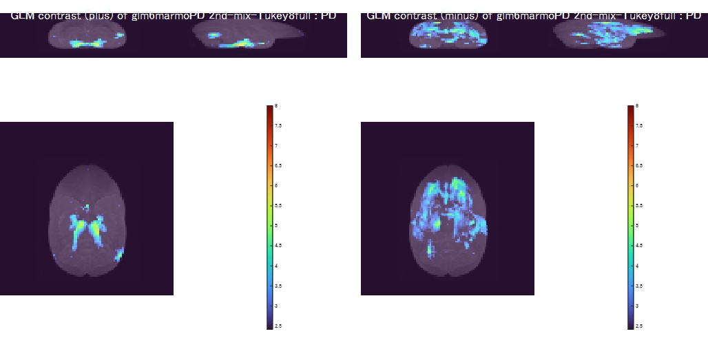

# GLM analysis for PD vs. WT marmoset
GLM analysis for PD vs. WT marmoset scripts on MATLAB

## Requirements: Software
* MATLAB R2019b or later
* Image Processing Toolbox ver11.0 or later
* Parallel Computing Toolbox ver7.1 or later

## Installation
1. Download this Toolbox zip file.
2. Extract zip files under your working directory <work_path>.
3. Run the MATLAB software, and "Add Path" extracted directories (i.e. <work_path>/marmoPDglm-master).
4. Move to <work_path>/marmoPDglm-master directory and run the following demos.

## Command Line Tools Demos
<b>Demo</b> 
This demo shows GLM analysis for PD vs. WT marmoset. 
(Copy and paste this command line. Demo data is included in this toolbox.)
~~~
>> testGLM6marmoPD
...
Height threshold: P-value=0.01, T-value=2.4102
Extent threshold: k=53 voxels, P-value=0.0068322 (0.040164)
Expected cluster list (num=6), degree of freedom=46, FWHM={5.3689 5.9061 3.5099} voxels
1) k=488 voxels, P uncorr=3.0704e-10, P fwe-corr=1.8422e-09
2) k=322 voxels, P uncorr=6.1665e-08, P fwe-corr=3.6999e-07
3) k=88 voxels, P uncorr=0.00091973, P fwe-corr=0.0055032
4) k=66 voxels, P uncorr=0.0031157, P fwe-corr=0.018521
5) k=59 voxels, P uncorr=0.0047214, P fwe-corr=0.027931
6) k=1577 voxels, P uncorr=1.6107e-21, P fwe-corr=0
Tmax of glm6marmoPD 2nd-mix-Tukey8full : PD tmax=5.7826, tcnt=619
~~~
This demo plots GLM contrast results of PD vs. WT marmoset:

